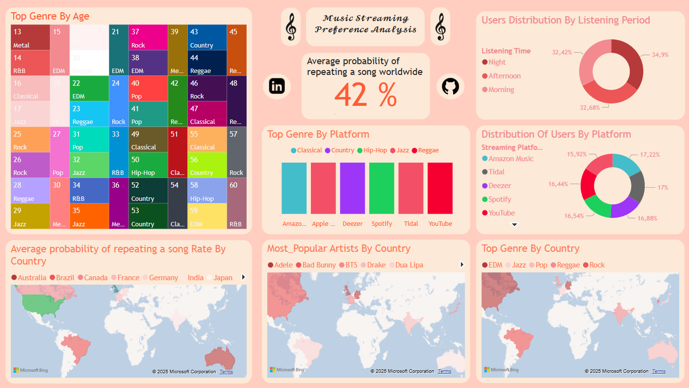

# 🎵 Music Streaming Preference Analysis

This repository contains an analysis of listener preferences on music platforms around the world. Python (Pandas) was used for data cleaning, and Power BI was used to create an interactive dashboard.

## 🚀 Project Objective
Explore music streaming trends and gain insights into listener preferences by genre, country, and other relevant metrics.

## 🛠️ Tools
- **Python (Pandas):** For data cleaning and transformation.
- **Power BI:** For interactive visualization and data analysis.

## 📊 Data Source
The dataset used in this project comes from Kaggle, a leading platform for data analysis and machine learning. You can find it at the following link: [Worldwide Music Streaming Trends and Insights](https://www.kaggle.com/datasets/salehahmedsaleh/worldwide-music-streaming-trends-and-insights).

### Dataset Details
The dataset contains information on music streaming trends across various countries, including preferred genres, average listening duration, and other key insights.

## 📋 Data Cleaning Methodology

The data cleaning and transformation process was performed using Python with **Pandas** combined with **pandasql**, which allowed leveraging the convenience and familiarity of SQL directly within the Python environment. This approach was ideal for efficiently querying and manipulating the dataset.

### Why Use SQL and pandasql?
1. **Convenience and Familiarity:**  
   SQL is a widely-used language for data manipulation, and its integration with pandasql allowed SQL queries to be applied without leaving the Python environment.

2. **Advantages of Pandas:**  
   While SQL is powerful, the versatility of Pandas allowed advanced tasks like statistical imputations and detailed transformations that are less intuitive in pure SQL.

3. **Efficient Workflow:**  
   The combination of these tools offered the best of both worlds:  
   - SQL for quickly filtering, joining, and selecting data.  
   - Pandas for more advanced operations, such as handling missing values, normalizing columns, and exporting the processed dataset.

4. **Export to CSV:**  
   The cleaned dataset was saved as a new CSV file (`clean_dataset.csv`), making it ready for import into Power BI while ensuring high-quality data for visualization.

This methodology ensures a professional and reproducible data cleaning process by utilizing modern tools that maximize both precision and productivity.

🎯 Final Dashboard
And here’s the final result—my dashboard! Built in Power BI, it highlights key insights, trends, and metrics derived from the dataset. From genre preferences to streaming platform engagement and global listening behaviors, this dashboard serves as a comprehensive tool for exploring music streaming trends worldwide

---

# 🎵 Análisis de Preferencias en Plataformas de Streaming Musical

Este repositorio contiene un análisis de las preferencias de los oyentes en plataformas de música de todo el mundo. Para la limpieza de datos se utilizó Python (Pandas) y para la generación de un dashboard interactivo se utilizó Power BI.

## 🚀 Objetivo del Proyecto
Explorar las tendencias en el streaming de música y obtener información sobre las preferencias de los oyentes según género, país y otros indicadores relevantes.

## 🛠️ Herramientas
- **Python (Pandas):** Para la limpieza y transformación de datos.
- **Power BI:** Para la visualización interactiva y el análisis de datos.

## 📊 Fuente de Datos
El conjunto de datos utilizado en este proyecto proviene de Kaggle, una plataforma líder en análisis de datos y aprendizaje automático. Puedes encontrarlo en el siguiente enlace: [Worldwide Music Streaming Trends and Insights](https://www.kaggle.com/datasets/salehahmedsaleh/worldwide-music-streaming-trends-and-insights).

### Detalles del Conjunto de Datos
El conjunto de datos contiene información sobre las tendencias de streaming musical en varios países, incluyendo géneros preferidos, duración promedio de escucha y otros datos clave.

## 📋 Metodología de Limpieza de Datos

El proceso de limpieza y transformación de datos se realizó con Python utilizando **Pandas** en combinación con **pandasql**, lo que permitió aprovechar la comodidad y familiaridad de SQL directamente en el entorno de Python. Este enfoque fue ideal para consultar y manipular el conjunto de datos de manera eficiente.

### ¿Por qué usar SQL y pandasql?
1. **Comodidad y Familiaridad:**  
   SQL es un lenguaje ampliamente utilizado para la manipulación de datos, y su integración con pandasql permitió aplicar consultas SQL sin salir del entorno de Python.

2. **Ventajas de Pandas:**  
   Aunque SQL es poderoso, la versatilidad de Pandas permitió realizar tareas avanzadas como imputaciones estadísticas y transformaciones detalladas que no son tan intuitivas en SQL puro.

3. **Flujo de Trabajo Eficiente:**  
   La combinación de estas herramientas ofreció lo mejor de ambos mundos:  
   - SQL para filtrar, unir y seleccionar datos rápidamente.  
   - Pandas para operaciones más avanzadas, como el manejo de valores faltantes, normalización de columnas y exportación del conjunto de datos procesado.

4. **Exportación a CSV:**  
   El conjunto de datos limpio se guardó como un nuevo archivo CSV (`clean_dataset.csv`), dejándolo listo para ser importado en Power BI y asegurando datos de alta calidad para la visualización.

Esta metodología garantiza un proceso de limpieza de datos profesional y reproducible mediante el uso de herramientas modernas que maximizan tanto la precisión como la productividad.

🎯 Resultado del Dashboard
Este es el resutlado de mi dashboard! Hecho en Power BI, it highlights key insights, tendencias, y metricas sacadas del dataset. Desde las preferencias de género hasta la interacción con las plataformas de streaming y comportamientos de escucha globales, este dashboard sirve como herramienta de buena comprencion para explorar tendencias del streaming de musica alrededor del mundo
🎯 Final Dashboard  
And here’s the final result—my dashboard! Built in Power BI, it highlights key insights, trends, and metrics derived from the dataset. From genre preferences to streaming platform engagement and global listening behaviors, this dashboard serves as a comprehensive tool for exploring music streaming trends worldwide.

